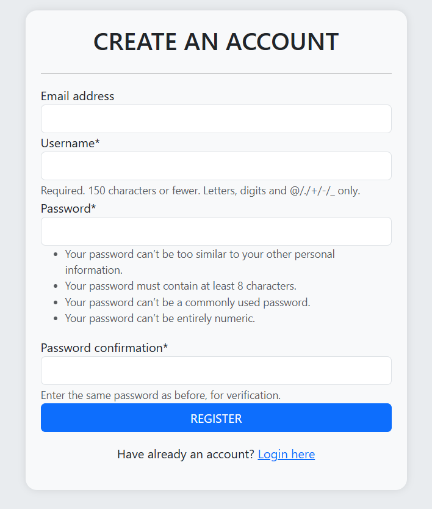
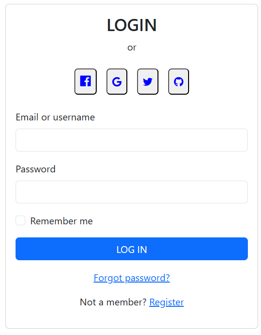
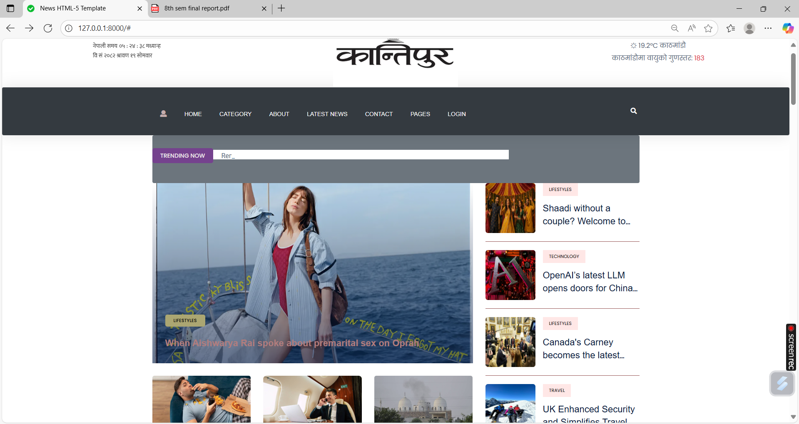
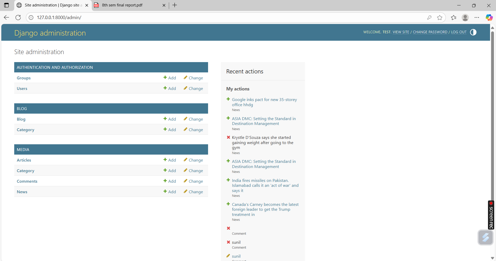
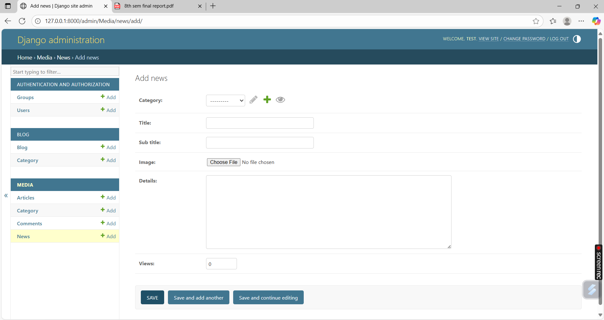

# Newportal-Website

## 🛠️ Tech Stack


## 📰 Kantipur News Portal Website

A full-stack responsive news portal developed using **Django (Python)** for the backend and **HTML, CSS, Bootstrap, JavaScript** for the frontend. This project was developed as part of the final semester industrial training at Shark IT Services Pvt. Ltd.

## 🚀 Features

- 📝 News and Blog Posting
- 👥 User Registration & Login
- 🔎 Search Functionality
- 🗂️ Category-wise Filtering
- 💬 Comment System
- 📱 Mobile Responsive Design
- 🔐 Admin Panel for Content Management

## 🚀 Live Features Overview

### 🔐 1. User Signup/Registration
- New users can register with a username, email, and password
- Django's authentication system ensures secure login/logout



### 🔐 1. User Login
- Logged-in users can comment on articles and blogs




## 📷 Screenshots

### Homepage


### Admin Panel





## 🔧 Tech Stack

- **Frontend**: HTML, CSS, Bootstrap, JavaScript
- **Backend**: Python, Django
- **Database**: SQLite
- **Tools**: VS Code, Git, GitHub


# Feature

### 📰 News Categories
- News filtered by categories: Politics, Sports, Technology, Entertainment, etc.
- Users can click on categories to view relevant news
- Admin can add/edit categories

### 📝 Blog Section
- Long-form content created by admin or contributors
- Supports title, image, author, publish date, and content
- Paginated layout for better readability

### 💬 Comment System
- Logged-in users can comment on blogs or news articles
- Comments are linked to the user and article
- Admin can moderate comments

### 📚 Admin Panel
- Powered by Django’s default admin interface
- Admin can manage:
  - News articles
  - Blog posts
  - Categories
  - Comments
  - Registered users
- Admin authentication required

### 🔍 Search Functionality
- Keyword-based search
- Searches titles and content of news & blogs
- Displays matched results in real-time

### 📱 Responsive Design
- Fully mobile-friendly and cross-browser compatible
- Navigation adjusts using Bootstrap grid and media queries
- Optimized for phone, tablet, and desktop

### 📤 Contact / Feedback Form
- Users can submit feedback or messages
- Includes fields: Name, Email, Subject, Message
- Data saved to database or emailed (if configured)


## 📦 Installation

```bash
git clone https://github.com/YOUR_USERNAME/kantipur-newsportal.git
cd kantipur-newsportal
pip install -r requirements.txt
python manage.py migrate
python manage.py runserver
